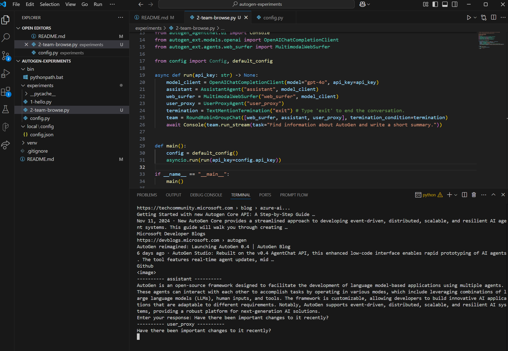

# Autogen Experiments
Working with Autogen to try some ideas.

[AutoGen GitHub](https://github.com/microsoft/autogen)


## Setup
### Ensure Python 3.10+
I have a Python 3.11 install which I don't typically use, so I made
a command `bin\pythonpath.bat` to put that first in my path.

## Install
```
python -m venv venv
venv\scripts\activate
pip install -U "autogen-agentchat" "autogen-ext[openai,web-surfer]" "autogenstudio"
pip install pytest-playwright
playwright install
```

## Configure API Key
Create file `local\config\config.json` like this:
```json
{
    "openai": {
        "api_key": "api key goes here"
    }
}
```

## Run
`python experiments\1-hello.py`

Results in
```
(venv) E:\proj\autogen-experiments>python experiments\1-hello.py
TaskResult(messages=[TextMessage(source='user', models_usage=None, content="Say 'Hello World!'", type='TextMessage'), TextMessage(source='assistant', models_usage=RequestUsage(prompt_tokens=41, completion_tokens=8), content='Hello World!  \nTERMINATE', type='TextMessage')], stop_reason=None)

(venv) E:\proj\autogen-experiments>python experiments\1-hello.py
TaskResult(messages=[TextMessage(source='user', models_usage=None, content='We are verifying that we have things connected correctly. Are you able to read this?', type='TextMessage'), TextMessage(source='assistant', models_usage=RequestUsage(prompt_tokens=53, completion_tokens=40), content='Yes, I can read your message. It seems like you are checking if your system is set up correctly. If you have any questions or need further verification, feel free to ask. TERMINATE', type='TextMessage')], stop_reason=None)
```

## Team Web Brose


When I asked it if there have been important changes to it recently, it said:

> AutoGen v0.4 brings significant updates to the framework, featuring a complete redesign to enhance code quality, robustness, and scalability. The new version introduces an asynchronous, event-driven architecture, allowing for more flexible multi-agent collaboration patterns. Key features include modular and extensible systems, observability and debugging tools, support for complex distributed networks, and cross-language interoperability. The update also offers built-in and community-driven extensions, facilitating a more robust and adaptable agentic AI ecosystem.
Enter your response: 